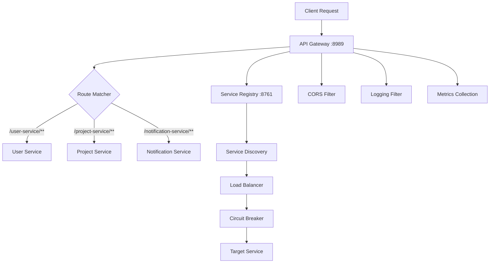

<div align="center">
  <h1>🚪 ScholarAI API Gateway</h1>
  <p><strong>Spring Cloud Gateway - Central API Entry Point</strong></p>
  
  [](https://spring.io/projects/spring-boot)
  [](https://spring.io/projects/spring-cloud)
  [](https://openjdk.org/)
  [](https://docs.spring.io/spring-framework/docs/current/reference/html/web-reactive.html)

  <p>Reactive API Gateway for the ScholarAI microservices ecosystem. Built with Spring Cloud Gateway for high-performance routing, load balancing, and API aggregation.</p>

  [Quick Start](#-quick-start) · [API Documentation](#-api-documentation) · [Configuration](#-configuration) · [Monitoring](#-monitoring)
</div>

---

## ✨ **Core Features**

### 🌐 **Intelligent Routing**
- **Dynamic Service Discovery**: Automatic route registration via Eureka integration
- **Load Balancing**: Client-side load balancing with multiple algorithm support
- **Path-based Routing**: RESTful URL patterns for service delegation
- **Header-based Routing**: Route requests based on headers and metadata

### 🔒 **Security & CORS**
- **CORS Configuration**: Comprehensive cross-origin resource sharing setup
- **Request Filtering**: Pre/post-processing filters for security and logging
- **Rate Limiting**: Built-in rate limiting and throttling capabilities
- **SSL/TLS Support**: HTTPS termination and certificate management

### 📊 **Monitoring & Observability**
- **Actuator Endpoints**: Health checks, metrics, and operational insights
- **Distributed Tracing**: Request tracing across microservices
- **Metrics Collection**: Prometheus-compatible metrics export
- **Real-time Monitoring**: Live gateway route and service status

### 🚀 **Performance**
- **Reactive Architecture**: Non-blocking I/O with Spring WebFlux
- **Connection Pooling**: Optimized HTTP client connection management
- **Response Caching**: Intelligent caching with Caffeine integration
- **Circuit Breaker**: Fault tolerance with automatic failover

### 📚 **API Documentation**
- **Swagger Integration**: Unified API documentation from all services
- **OpenAPI 3.0**: Standard API specification format
- **Interactive Testing**: Built-in API testing interface
- **Service Aggregation**: Single endpoint for all microservice APIs

---

## 🚀 **Quick Start**

### Prerequisites
- **Java 21+** (OpenJDK recommended)
- **Maven 3.8+** for building
- **Service Registry** running on port 8761
- **Docker** (optional, for containerized deployment)

### 🛠️ **Local Development**

1. **Clone and Build**
   ```bash
   git clone https://github.com/Javafest2025/api-gateway.git
   cd api-gateway
   ./mvnw clean install
   ```

2. **Environment Setup**
   ```bash
   cp env.example .env
   ```
   
   Configure your `.env` file:
   ```env
   SPRING_PROFILE=local
   SERVER_PORT=8989
   HOSTNAME=localhost
   EUREKA_URL=http://localhost:8761/eureka/
   ```

3. **Start Service Registry First**
   ```bash
   # Ensure service-registry is running on port 8761
   curl http://localhost:8761/actuator/health
   ```

4. **Run API Gateway**
   ```bash
   ./mvnw spring-boot:run -Dspring-boot.run.profiles=local
   ```
   
   🌐 **Gateway Dashboard:** `http://localhost:8989/actuator/gateway/routes`
   📚 **API Documentation:** `http://localhost:8989/swagger-ui.html`

### 🐳 **Docker Deployment**

#### Using Docker Compose (Recommended)
```bash
# Start API Gateway with dependencies
docker-compose up -d

# View logs
docker-compose logs -f api-gateway

# Stop service
docker-compose down
```

#### Using Docker Scripts
```bash
# Build and start
./scripts/docker.sh up

# View logs
./scripts/docker.sh logs

# Check health
./scripts/docker.sh health

# Stop service
./scripts/docker.sh stop

# Clean up
./scripts/docker.sh clean
```

#### Manual Docker Commands
```bash
# Build image
docker build -t scholar-api-gateway .

# Run container
docker run -d --name scholar-api-gateway \
  -p 8989:8989 \
  -e SPRING_PROFILES_ACTIVE=docker \
  -e EUREKA_CLIENT_SERVICE_URL_DEFAULTZONE=http://service-registry:8761/eureka/ \
  --network scholarai-network \
  scholar-api-gateway
```

---

## 🏗️ **Architecture**

### 🌊 **Request Flow**



### 🔌 **Service Integration**

| Service | Route Pattern | Description |
|---------|---------------|-------------|
| **User Service** | `/user-service/**` | Authentication, user management |
| **Project Service** | `/project-service/**` | Academic projects, workspaces |
| **Notification Service** | `/notification-service/**` | Real-time notifications |
| **Document Service** | `/document-service/**` | PDF processing, file management |

### 🛡️ **Security Layers**

```yaml
# CORS Configuration
spring.cloud.gateway.globalcors:
  cors-configurations:
    '[/**]':
      allowed-origins: ["http://localhost:3000"]
      allowed-methods: ["GET", "POST", "PUT", "DELETE", "OPTIONS"]
      allowed-headers: "*"
      allow-credentials: true
```

---

## ⚙️ **Configuration**

### 🏠 **Local Development (`application-local.yml`)**
```yaml
spring:
  application:
    name: api-gateway
  server:
    port: 8989
  cloud:
    gateway:
      discovery:
        locator:
          enabled: true
          lower-case-service-id: true
      httpclient:
        response-timeout: 60000
        connect-timeout: 30000
        pool:
          max-idle-time: PT15S
          max-life-time: PT60S
```

### 🐳 **Docker Environment (`application-docker.yml`)**
```yaml
eureka:
  client:
    service-url:
      defaultZone: http://service-registry:8761/eureka/
    register-with-eureka: true
    fetch-registry: true
  instance:
    prefer-ip-address: true
    hostname: api-gateway
```

### 🚀 **Production Configuration**
```yaml
spring:
  cloud:
    gateway:
      httpclient:
        ssl:
          use-insecure-trust-manager: false
        response-timeout: 30000
        pool:
          max-connections: 500
          max-idle-time: PT30S
```

### 🔧 **Environment Variables**

| Variable | Description | Default |
|----------|-------------|---------|
| `SPRING_PROFILES_ACTIVE` | Active Spring profile | `local` |
| `SERVER_PORT` | Gateway server port | `8989` |
| `EUREKA_CLIENT_SERVICE_URL_DEFAULTZONE` | Eureka server URL | `http://localhost:8761/eureka/` |
| `HOSTNAME` | Gateway hostname | `localhost` |

---

## 📚 **API Documentation**

### 🌐 **Swagger UI**
Access comprehensive API documentation at `http://localhost:8989/swagger-ui.html`

**Features:**
- **Unified Documentation**: All microservice APIs in one place
- **Interactive Testing**: Try APIs directly from the browser
- **Authentication Support**: Test secured endpoints
- **Request/Response Examples**: Complete API usage examples

### 📋 **Available Endpoints**

#### 🔍 **Gateway Management**
| Endpoint | Method | Description |
|----------|--------|-------------|
| `/actuator/gateway/routes` | GET | List all configured routes |
| `/actuator/gateway/routes/{id}` | GET | Get specific route details |
| `/actuator/gateway/refresh` | POST | Refresh gateway routes |
| `/actuator/gateway/globalfilters` | GET | List global filters |

#### 🏥 **Health & Monitoring**
| Endpoint | Method | Description |
|----------|--------|-------------|
| `/actuator/health` | GET | Gateway health status |
| `/actuator/info` | GET | Application information |
| `/actuator/metrics` | GET | Prometheus metrics |
| `/actuator/prometheus` | GET | Prometheus endpoint |

#### 📊 **Service Proxying**
| Route | Target Service | Description |
|-------|---------------|-------------|
| `/user-service/**` | User Service | User authentication & management |
| `/project-service/**` | Project Service | Academic project operations |
| `/notification-service/**` | Notification Service | Real-time notifications |

### 🔧 **API Usage Examples**

#### Get All Routes
```bash
curl -X GET http://localhost:8989/actuator/gateway/routes \
  -H "Accept: application/json"
```

#### Proxy Request to User Service
```bash
curl -X GET http://localhost:8989/user-service/api/v1/users \
  -H "Authorization: Bearer {token}" \
  -H "Accept: application/json"
```

#### Health Check
```bash
curl http://localhost:8989/actuator/health
```

**Response:**
```json
{
  "status": "UP",
  "components": {
    "discoveryComposite": {
      "status": "UP",
      "components": {
        "eureka": {
          "status": "UP",
          "details": {
            "applications": {
              "USER-SERVICE": 2,
              "PROJECT-SERVICE": 1
            }
          }
        }
      }
    },
    "gateway": {
      "status": "UP"
    }
  }
}
```

---

## 🔧 **Development & Testing**

### 🧪 **Running Tests**

```bash
# Unit tests
./mvnw test

# Integration tests
./mvnw verify

# Build with tests
./mvnw clean package
```

### 🐛 **Testing Gateway Routes**

1. **Start Dependencies**
   ```bash
   # Start service registry
   cd ../service-registry && ./mvnw spring-boot:run

   # Start a test microservice
   cd ../user-service && ./mvnw spring-boot:run
   ```

2. **Start API Gateway**
   ```bash
   ./mvnw spring-boot:run -Dspring-boot.run.profiles=local
   ```

3. **Test Route Discovery**
   ```bash
   # Check registered routes
   curl http://localhost:8989/actuator/gateway/routes

   # Test service proxying
   curl http://localhost:8989/user-service/actuator/health
   ```

### 📊 **Load Testing**

```bash
# Install Apache Bench
sudo apt-get install apache2-utils

# Test gateway performance
ab -n 1000 -c 10 http://localhost:8989/actuator/health

# Test service proxying
ab -n 1000 -c 10 http://localhost:8989/user-service/actuator/health
```

### 🔍 **Debugging**

```yaml
# Enable debug logging
logging:
  level:
    org.springframework.cloud.gateway: DEBUG
    reactor.netty: DEBUG
    org.springframework.web: DEBUG
```

---

## 🚀 **Production Deployment**

### 🌐 **Multi-Instance Setup**

```yaml
# docker-compose.prod.yml
version: '3.8'
services:
  api-gateway-1:
    image: scholar-api-gateway:latest
    ports:
      - "8989:8989"
    environment:
      - INSTANCE_ID=gateway-1
      
  api-gateway-2:
    image: scholar-api-gateway:latest
    ports:
      - "8990:8989"
    environment:
      - INSTANCE_ID=gateway-2
```

### 🔒 **SSL/TLS Configuration**

```yaml
server:
  ssl:
    enabled: true
    key-store: classpath:keystore.p12
    key-store-password: ${SSL_PASSWORD}
    key-store-type: PKCS12
    key-alias: scholarai
```

### 📊 **Performance Tuning**

```yaml
spring:
  cloud:
    gateway:
      httpclient:
        pool:
          max-connections: 1000
          max-idle-time: PT60S
          max-life-time: PT300S
        response-timeout: 30000
  codec:
    max-in-memory-size: 50MB
```

### 🔍 **Monitoring Integration**

```yaml
management:
  endpoints:
    web:
      exposure:
        include: health,info,prometheus,metrics,gateway
  metrics:
    export:
      prometheus:
        enabled: true
    tags:
      application: ${spring.application.name}
      environment: ${ENV:prod}
```

---

## 🔍 **Troubleshooting**

### 🚨 **Common Issues**

#### Service Not Found (503 Error)
```bash
# Check service registration
curl http://localhost:8761/eureka/apps

# Verify gateway routes
curl http://localhost:8989/actuator/gateway/routes

# Check service health
curl http://localhost:8989/user-service/actuator/health
```

#### CORS Issues
```yaml
# Verify CORS configuration
spring.cloud.gateway.globalcors:
  cors-configurations:
    '[/**]':
      allowed-origins: ["http://localhost:3000"]
      allowed-methods: ["*"]
      allowed-headers: ["*"]
      allow-credentials: true
```

#### Connection Timeouts
```yaml
# Increase timeout values
spring.cloud.gateway.httpclient:
  response-timeout: 120000
  connect-timeout: 60000
```

#### Memory Issues
```bash
# Increase heap size
JAVA_OPTS="-Xms1g -Xmx2g -XX:+UseG1GC"

# Monitor memory usage
curl http://localhost:8989/actuator/metrics/jvm.memory.used
```

### 📋 **Health Check Failures**

```bash
# Gateway health
curl -v http://localhost:8989/actuator/health

# Service discovery health
curl http://localhost:8989/actuator/health/discoveryComposite

# Check Eureka connection
curl http://localhost:8989/actuator/health/eureka
```

### 🔧 **Debug Mode**

```yaml
# Enable comprehensive debugging
logging:
  level:
    root: INFO
    org.springframework.cloud.gateway: DEBUG
    org.springframework.web.reactive: DEBUG
    reactor.netty.http.client: DEBUG
```

---

## 🤝 **Contributing**

### 🚀 **Development Setup**
1. Fork the repository
2. Create a feature branch (`git checkout -b feature/amazing-feature`)
3. Ensure service-registry is running
4. Make your changes and add tests
5. Run the test suite (`./mvnw test`)
6. Test with actual microservices
7. Commit your changes (`git commit -m 'Add amazing feature'`)
8. Push to the branch (`git push origin feature/amazing-feature`)
9. Open a Pull Request

### 📋 **Coding Standards**
- Follow Spring Boot conventions
- Use reactive programming patterns (WebFlux)
- Add comprehensive tests for new routes/filters
- Update documentation for configuration changes
- Ensure all tests pass before submitting PR

### 🐛 **Reporting Issues**
- Use the GitHub issue tracker
- Provide detailed reproduction steps
- Include gateway logs and service responses
- Specify Java version and Spring Cloud version

---

## 📄 **License**

This project is licensed under the **MIT License** - see the [LICENSE.md](LICENSE.md) file for details.

---

## 🙏 **Acknowledgments**

- **Spring Cloud Team** for the excellent Gateway framework
- **Reactor Project** for reactive programming support
- **Netflix OSS** for service discovery patterns
- **Community Contributors** for feedback and improvements

---

<div align="center">
  <p><strong>Built with ⚡ for the ScholarAI microservices ecosystem</strong></p>
  <p>
    <a href="http://localhost:8989/swagger-ui.html">API Docs</a> •
    <a href="http://localhost:8989/actuator/gateway/routes">Routes</a> •
    <a href="http://localhost:8989/actuator">Actuator</a> •
    <a href="https://github.com/Javafest2025/api-gateway/issues">Support</a>
  </p>
</div>
